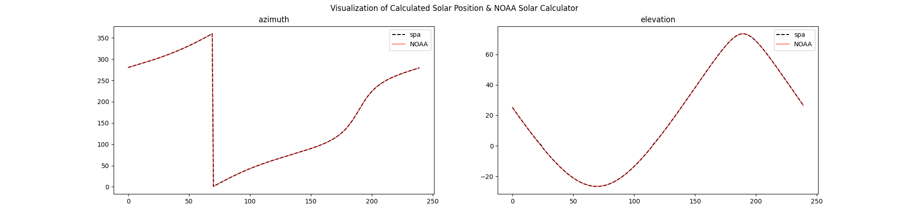
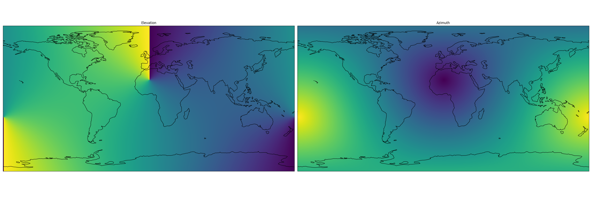

# torch spa

A Python implementation of the Solar Position Algorithm (SPA) for PyTorch.

## Installation

Simple install using pip

```bash
python3.11 -m venv .venv
source .venv/bin/activate
pip install git+https://github.com/leaver2000/torch_spa@master
```

Timeseries comparison of the NOAA Solar Calculator and torch_spa



Globe plot of the solar position algorithm




